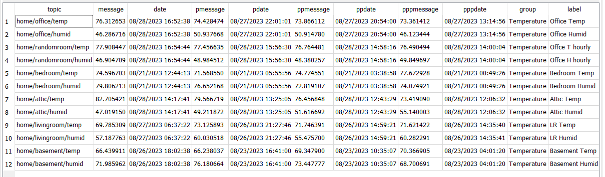

# Welcome to HomeView

### _One view says it all_

This project allows you to easily display MQTT data as a simple web site. It is similar to the cards provided by Home Assistant, but designed as a standalone MQTT viewer.

HomeView consists of a NodeJS web server that subscribes to specified MQTT topics. These topics are then displayed on a main web page using a format you specify.

The app uses Handlebar templates to render/compile the data. There is a main page with all the groups listed, and each group has its own template.

When the server receives a new MQTT message, it saves the data to a SQLite database. It then queries the database to get the last 4 data points for that group, compiles the template, and sends the updated HTML to the web page using WebSockets.

This means the page does not need to reload when new data comes in. Only the specific group gets updated dynamically. So groups get updated indivually allows you can see the latest updates for each group.

> 

## Usage

To use the project:

1. Update `main.hbs` with the groups you want displayed. Each group needs a `<div></div>` containing the group name, example below. I used [W3.CSS](https://www.w3schools.com/w3css/default.asp) as the CSS framework. "W3.CSS is Smaller, Faster and Easier to Use. _A Quality Alternative to Bootstrap_".

> main.hbs

```
<div class='w3-row'>
  <div class='w3-col'>
    <div id='Doors'>{{Doors}}</div>
  </div>
</div>
<div class='w3-row'>
    <div id='Temperature'>{{Temperature}}</div>
  </div>
</div>
<div class='w3-row'>
  <div class='w3-half'>
    <div id='Voltage'>{{Voltage}}</div>
  </div>
  <div class='w3-half'>
    <div id='Laptop'>{{Laptop}}</div>
  </div>
</div>
```

2. Under `\views\templates`, this is where you create your .hbs file the same name as the group. For example, I have a `Temperature` group for my sensors I made. I created a `Temperature.hbs` file like below.

> Temperature.hbs

```
<div class="w3-container" data-group="{{group}}" id="grp{{group}}">
  <div class="w3-card-4" >
    <header class="w3-container w3-blue">
      <h3 style="margin: 1px 0;">{{group}}</h3>
    </header>

    <div class="w3-container">
<table class="w3-table-all w3-responsive w3-striped w3-bordered w3-card-4">
<tr>
  <th>Sensor</th>
  <th>Temp</th>
  <th>Date</th>
  <th>Temp -1</th>
  <th>Date</th>
  <th>Temp -2</th>
  <th>Date</th>
  <th>Temp -3</th>
  <th>Date</th>
</tr>
{{#each topics}}
<tr>
  <td><a href="/detail?topic={{topic}}" style="text-decoration: none;" >{{label}}</a></td>
  <td>{{messagenumber message 1}}</td>
  {{#ifdatebetween date  ../updateddate}}
  <td><span class="w3-tag">{{dayjs date "MM/DD/YYYY hh:mm:ss A" "1"}}</span></td>
  {{else}}
  <td>{{dayjs date "MM/DD/YYYY hh:mm:ss A" "1"}}</td>
  {{/ifdatebetween}}
  <td>{{messagenumber pmessage 1}}</td>
  <td>{{dayjs pdate "MM/DD/YYYY hh:mm:ss A" "1"}}</td>
  <td>{{messagenumber ppmessage 1}}</td>
  <td>{{dayjs ppdate "MM/DD/YYYY hh:mm:ss A" "1"}}</td>
  <td>{{messagenumber pppmessage 1}}</td>
  <td>{{dayjs pppdate "MM/DD/YYYY hh:mm:ss A" "1"}}</td>
</tr>
{{/each}}
</table>
    </div>

    <footer class="w3-container w3-blue">
      <h5 style="margin: 1px 0;">last updated: {{updateddate}}</h5>
    </footer>
  </div>
</div>
```

This above handlbars template file get compiled each time a mqtt subscription is received. It is then sent to the websocket which then updates the div listed for that group.

3. You will need to run `npm install` in order to grab all the node modules.
4. Run `node server.js` to start the web server

5. Open the web interface in a browser to view your data which is located on http://localhost:3000.

On first load, you will be redirected to a setup page to enter at least one MQTT topic along with the connection details to your mqtt server. Upon pressing `Save all Settings` the site will restart the mqtt topics subscriptions and depending on what data has changed will force a reload of any connected html pages.

The web site can be viewed on a device like a Raspberry Pi connected to a TV or monitor. For example, a Pi 3B+ works well as a server, while an original Pi Zero is too slow to run as the server, it works okay for displaying the data.

Please note that ALL sql returned will have these fields:

**You can use this in your Handlebar(.hbs) file.**

- `topic` = the topic you subscribed to in mqtt
- `message` = the message returned.
- `date` = the current date time of the newly arrived message.
- `pmessage` = Previous message received
- `pdate` = Previous date.
- `ppmessage` = Previous previous message received
- `ppdate` = Previous previous date.
- `pppmessage` = Previous previous previous message received
- `pppdate` = Previous previous previous date.
- ^^^I know, I know. what else do you name these?^^^
- `group` = The group that topic is associated with
- `label` = How you prefer it displayed.

There are a few helper function that can be used as well. Here is an example of dayjs being used to format the datetime.`<td>{{dayjs date "MM/DD/YYYY hh:mm:ss A" "1"}}</td>`. The "1" is another option where as if the day is the same as the current day, only show the time part. Messagenumber `<td>{{messagenumber message 1}}</td>` is used to format a floating point humber into X decimal places.



## Setup Page

The [setup](./images/setup.png) page allows you to configure your MQTT IP,User and Password. It is also where you enter in the topics you want to view on the main page.
The topics are listed out in a Datatable. You can add/edit/remove a topic to be monitored.  
Make sure you click the `Save all Settings` when you complete your setup.


## Examples

The items listed in the example folder is based on what I use for my home setup. Based on what you see in the first screenshot.

## Pi Setup

I mentioned running this on a Pi. I have mine running using PM2. I also updated my service file to do a git pull before starting the service. That way my code is always up to date. If you fork your own branch, then you could also include your templates and main.hbs file to get pulled as well.

> sudo nano /etc/systemd/system/pm2-{your user name}.service

```
[Unit]
Description=PM2 process manager
Documentation=https://pm2.keymetrics.io/
After=network-online.target
Wants=network-online.target

[Service]
Type=forking
User=taughenbaugh
LimitNOFILE=infinity
LimitNPROC=infinity
LimitCORE=infinity
Environment=PATH=/home/taughenbaugh/.nvm/versions/node/v18.17.1/bin:/usr/local/sbin:/usr/local/bin:/usr/sbin:/usr/bin:/sbin:/bin:/usr/local/games:/us>
Environment=PM2_HOME=/home/taughenbaugh/.pm2
PIDFile=/home/taughenbaugh/.pm2/pm2.pid
Restart=on-failure
WorkingDirectory=/home/taughenbaugh/app/HomeView
ExecStartPre=/usr/bin/git -C /home/taughenbaugh/app/HomeView pull
ExecStartPre=npm install
ExecStart=/home/taughenbaugh/.nvm/versions/node/v18.17.1/lib/node_modules/pm2/bin/pm2 resurrect
ExecReload=/home/taughenbaugh/.nvm/versions/node/v18.17.1/lib/node_modules/pm2/bin/pm2 reload all
ExecStop=/home/taughenbaugh/.nvm/versions/node/v18.17.1/lib/node_modules/pm2/bin/pm2 kill

[Install]
WantedBy=multi-user.target

```

I might update this after I setup from scratch again.
I had to try severals different things to get stuff to work as I wanted. Which means, I have no idea if this below is exactly as stated.

sudo npm install -g pm2

I installed `HomeView` into an `app` folder on my home user folder.

If you cd into your app folder after it is created. You can run:

```
git clone https://github.com/Invisibleman1002/HomeView.git
```

This will create the intial `HomeView` folder with all the files.

Once in here, you need to run `npm install` to get the node modules.

You can either use the existing `/HomeView/view/templates/test.hbs` or generate your own based on the groups you know you want to create.
Also rename the file `rename_to_main.hbs` to main.hbs, and add your new groups here as well. My example is located above.

Before setting it up in pm2, I recommend running `npm start`. This will create the blank database and start the web server on port 3000. Open a browser and go to http://localhost:3000 on your pi, or connect to another machine using your Pis ip address.

Once you save, if this all works, you can set off a sensor and see it on the HomeView. You should also see some console.log message showing the details of the MQTT topic it received. If everything works as expected, exit this service and finish the PM2 setup.

While in the HomeView folder, you can type `pm2 start server.js`. Command `pm2 ls` will list the services. I think you also need to do a `pm2 save` so it stays active on a reboot.

OH! You can use https://sqlitebrowser.org/ to view the database file. If you use this, you can also load the included [db.sqbpro](db.sqbpro) file to view all the SQL statments I created in designing this. You're going to love the SQL for getting all the details based on the Topic received. Its a 100 lines of pure luck that it worked.
